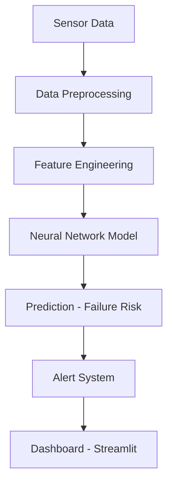
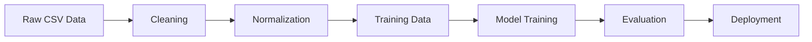
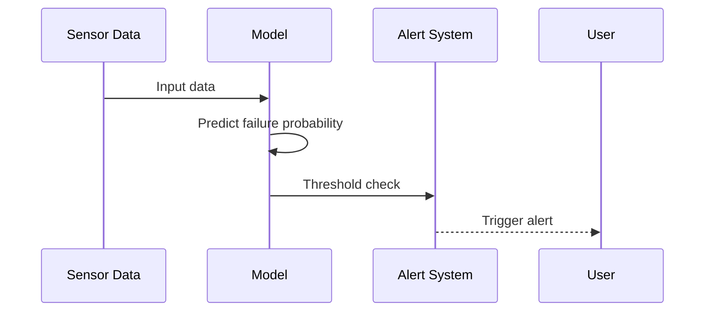
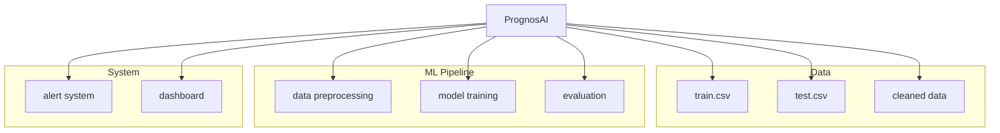

# PrognosAI — AI-Driven Predictive Maintenance System

A scalable AI system for predictive maintenance using time-series sensor data, designed to detect failures early, reduce downtime, and enable proactive maintenance decisions.

Built as part of **Infosys Springboard 6.0**.

---

## Overview

PrognosAI is an end-to-end machine learning system that transforms raw sensor data into actionable maintenance insights.

The system combines:
- Time-series data processing  
- Neural network-based prediction  
- Real-time monitoring dashboard  
- Intelligent alert system  

Goal:
**Predict failures before they occur and optimize equipment performance.**

---

## Problem Statement

Industries face major challenges due to unexpected equipment failures:

- Unplanned downtime disrupts operations  
- High maintenance costs from emergency repairs  
- Safety risks for personnel  
- Revenue loss due to production halts  

Traditional reactive maintenance is inefficient.

👉 PrognosAI shifts the paradigm to **predictive maintenance**.

---

## System Architecture



---

## ML Pipeline



---

## Alert Flow



---

## Model Architecture

- Neural Network: **Dense (64 → 64 → 1)**
- Activation: ReLU  
- Optimizer: Adam  
- Loss Function: Mean Squared Error  
- Validation Split: 20%  

---

## Performance Metrics

| Metric | Value |
|--------|------|
| R² Score | 0.76 |
| RMSE | Low |
| MAE | Low |

The model demonstrates strong predictive capability and stability.

---

## Key Features

- End-to-end ML pipeline  
- Time-series sensor data processing  
- Neural network-based prediction  
- Real-time monitoring dashboard (Streamlit)  
- Intelligent alert generation system  
- Evaluation and performance analysis  

---

## Project Structure (Visual)



---

## Tech Stack

- Python  
- Pandas  
- TensorFlow  
- NumPy  
- Streamlit  
- Matplotlib  

---

## How to Run

### 1. Data Preparation
```bash
python milestone.py
```

### 2. Train Model
```bash
python train_model.py
```

### 3. Run Dashboard
```bash
streamlit run app.py
```

---

## Dashboard Features

- Real-time equipment monitoring  
- Remaining Useful Life (RUL) visualization  
- Performance metrics display  
- Interactive data exploration  

---

## Key Highlights

- Achieved **76% R² score**  
- End-to-end predictive maintenance system  
- Real-time alert generation  
- Scalable ML pipeline design  
- Practical industrial use case  

---

## Future Enhancements

- LSTM-based time-series modeling  
- Cloud deployment (AWS / GCP)  
- Real-time streaming data integration  
- Multi-sensor fusion  
- Advanced anomaly detection  

---

## Author

**Rakesh Pedapudi**  
Artificial Intelligence · Machine Learning · Systems Design  

---

## License

This project is licensed under the **MIT License**.
